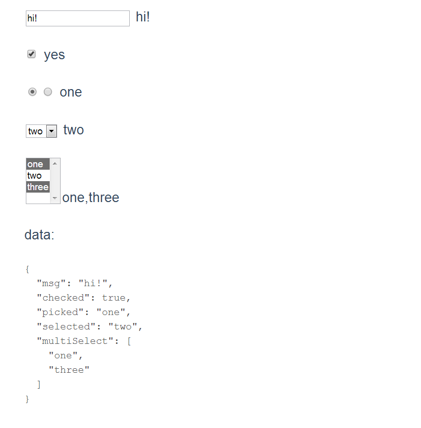

# 处理表单

## 基本用法

你可以在表单的 input 元素上使用 `v-model` 指令来创建双向数据绑定。它会根据 input 元素的类型自动选取正确的绑定模式。

**示例**

```
<form id="demo">
  <!-- text -->
  <p>
    <input type="text" v-model="msg">
    {{msg}}
  </p>
  <!-- checkbox -->
  <p>
    <input type="checkbox" v-model="checked">
    {{checked ? "yes" : "no"}}
  </p>
  <!-- radio buttons -->
  <p>
    <input type="radio" name="picked" value="one" v-model="picked">
    <input type="radio" name="picked" value="two" v-model="picked">
    {{picked}}
  </p>
  <!-- select -->
  <p>
    <select v-model="selected">
      <option>one</option>
      <option>two</option>
    </select>
    {{selected}}
  </p>
  <!-- multiple select -->
  <p>
    <select v-model="multiSelect" multiple>
      <option>one</option>
      <option>two</option>
      <option>three</option>
    </select>
    {{multiSelect}}
  </p>
  <p><pre>data: {{$data | json 2}}</pre></p>
</form>
```

```
new Vue({
  el: '#demo',
  data: {
    msg      : 'hi!',
    checked  : true,
    picked   : 'one',
    selected : 'two',
    multiSelect: ['one', 'three']
  }
})
```

**效果**



## 惰性更新

默认情况下，`v-model` 会在每个 `input` 事件之后同步输入的数据。你可以添加一个 `lazy` 特性，将其改变为在 `change` 事件之后才进行同步。

```
<!-- 在 "change" 而不是 "input" 事件触发后进行同步 -->
<input v-model="msg" lazy>
```

## 转换为数字

如果你希望将用户的输入自动转换为数字，你可以在 `v-model` 所在的 `input` 上添加一个 `number` 特性。

`<input v-model="age" number>`

## 动态 select 选项

当你需要为一个 `<select>` 元素动态渲染列表选项时，推荐将 `options` 特性和 `v-model` 指令配合使用，这样当选项动态改变时，`v-model` 会正确地同步：

`<select v-model="selected" options="myOptions"></select>`

在你的数据里，`myOptions` 应该是一个指向选项数组的路径或是表达式。

该数组可以包含普通字符串或对象。对象的格式应为 `{text:'', value:''}`。这允许你把展示的文字和其背后对应的值区分开来。

```
[
  { text: 'A', value: 'a' },
  { text: 'B', value: 'b' }
]
```

会渲染成：

```
<select>
  <option value="a">A</option>
  <option value="b">B</option>
</select>
```

另外，数组里对象的格式也可以是 `{label:'', options:[...]}`。这样的数据会被渲染成为一个 `<optgroup>`：

```
[
  { label: 'A', options: ['a', 'b']},
  { label: 'B', options: ['c', 'd']}
]
```

会渲染成：

```
<select>
  <optgroup label="A">
    <option value="a">a</option>
    <option value="b">b</option>
  </optgroup>
  <optgroup label="B">
    <option value="c">c</option>
    <option value="d">d</option>
  </optgroup>
</select>
```

你的原始数据很有可能不是这里所要求的格式，因此在动态生成选项时必须进行一些数据转换。为了简化这种转换，`options` 特性支持过滤器。将数据的转换逻辑做成一个可复用的 **自定义过滤器** 。通常来说是个好主意：

```
Vue.filter('extract', function (value, keyToExtract) {
  return value.map(function (item) {
    return item[keyToExtract]
  })
})
```

```
<select
  v-model="selectedUser"
  options="users | extract 'name'">
</select>
```

上述过滤器将像 `[{ name: 'Bruce' }, { name: 'Chuck' }]` 这样的原始数据转化为 `['Bruce', 'Chuck']`，从而符合动态选项的格式要求。

## 输入 Debounce

在一次输入被同步到模型之前，`debounce` 特性允许你设置一个每次用户事件后的等待延迟。如果在这个延迟到期之前用户再次输入，则不会立刻触发更新，而是重置延迟的等待时间。当每次更新前你要执行繁重作业时会很有用，例如一个基于 ajax 的自动补全功能。

`<input v-model="msg" debounce="500">`

**结果**


注意 `debounce` 参数并不对用户的输入事件进行 `debounce`：它只对底层数据的 “写入” 操作起作用。因此当使用 `debounce` 时，你应该用 `vm.$watch()` 而不是 `v-on` 来响应数据变化。

下一步：[计算属性](attributes.md)